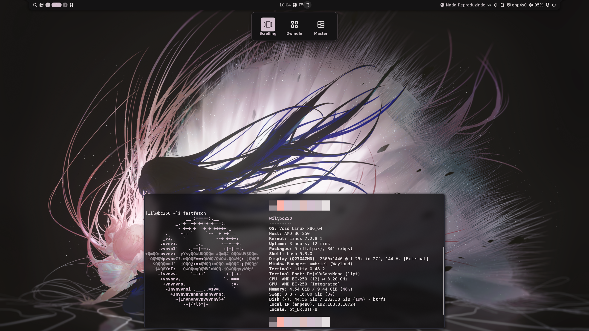

# Umbriel para Void Linux (x86_64)

[](https://github.com/Wiljapa/umbriel-void/actions/workflows/build.yml)
[](https://github.com/Wiljapa/umbriel-void/releases/latest)
[](https://voidlinux.org/)
[](LICENSE)

Pacote binário pré-compilado e atualizado do compositor Wayland **[Umbriel](https://github.com/noctalia-dev/umbriel)** para **Void Linux**.

O Umbriel é um compositor Wayland moderno construído sobre o `wlroots`, com suporte nativo a layouts *scrolling*, *dwindle* e *master*, além de shaders e animações.

Este repositório fornece a suíte oficial completa:
- **`umbriel`**: Compositor Wayland com compatibilidade nativa para aplicativos antigos X11 (`xorg-server-xwayland`) e gerenciamento de cores ICC (`lcms2`).
- **`xdg-desktop-portal-umbriel`**: Portal oficial com seletor de telas/janelas (`umbriel-share-picker`) para compartilhamento de tela no Discord, Google Meet e gravação no OBS Studio.

> Ao instalar o `umbriel` pelo XBPS, o portal e os componentes de compatibilidade são instalados automaticamente como dependências!

Este repositório compila automaticamente novas versões na nuvem (via GitHub Actions) todos os dias assim que surgem novos commits no repositório oficial do Umbriel.

<p align="center">
  
</p>

---

## ⚡ Como Instalar

Você pode instalar o Umbriel de duas formas: como repositório nativo do Void Linux (recomendado para receber atualizações automáticas do sistema) ou via script em 1 linha.

### Método 1: Repositório Nativo do XBPS (Recomendado)
Adicione o repositório nas configurações do Void Linux. Dessa forma, **sempre que você rodar `sudo xbps-install -Syu`, o Umbriel será atualizado automaticamente junto com o sistema!**

```bash
# 1. Adicionar o repositório na configuração do XBPS
echo "repository=https://wiljapa.github.io/umbriel-void" | sudo tee /etc/xbps.d/20-umbriel.conf

# 2. Sincronizar e instalar (pressione 'Y' para aceitar a chave do repositório)
sudo xbps-install -Syu umbriel
```

---

### Método 2: Script em Linha Única
Se preferir instalar sem adicionar o repositório permanente:

```bash
curl -sSL https://raw.githubusercontent.com/Wiljapa/umbriel-void/main/install.sh | bash
```

---

### Método 3: Download Manual
Baixe o pacote `.xbps` diretamente na página de **[Releases](https://github.com/Wiljapa/umbriel-void/releases/latest)** e instale:
```bash
sudo xbps-install --repository=$PWD -u umbriel
```

---

## ⚙️ Pós-Instalação: Criando seu `config.toml`

Antes de iniciar o Umbriel pela primeira vez, você deve criar a pasta de configuração no seu usuário e copiar o modelo padrão que o pacote instala:

```bash
mkdir -p ~/.config/umbriel
cp /usr/share/umbriel/config.toml ~/.config/umbriel/
```

> **Dica:** Sempre que editar seu arquivo de configuração, valide se a sintaxe está correta com:
> ```bash
> umbriel validate
> ```

---

## 🎨 Integração com o Noctalia Desktop Shell

O Umbriel foi desenhado pelos mesmos criadores do **[Noctalia Shell](https://github.com/noctalia-dev/noctalia)** (barra de status, launcher de apps, notificações, wallpaper e painéis do sistema). 

Após copiar seu `config.toml` como mostrado acima, configure-o para iniciar e controlar o Noctalia:

### 1. Inicialização automática (Autostart)
Abra o arquivo `~/.config/umbriel/config.toml` e adicione o `noctalia` e o servidor de áudio no bloco `[general]`:

```toml
[general]
autostart = [
    "noctalia",        # Inicia a barra, notificações e wallpaper do Noctalia
    "pipewire",        # Servidor de áudio
    "wireplumber",     # Gerenciador de sessão multimídia
    "pipewire-pulse",  # Compatibilidade com PulseAudio
]
```

### 2. Atalhos para controlar o Noctalia
No bloco `[keybinds]`, adicione atalhos para abrir o menu de aplicativos (launcher) e terminal:

```toml
[keybinds]
# Abrir o terminal (ex: kitty, foot, alacritty)
"Mod+Return" = { action = "spawn:kitty", repeat = false }

# Abrir / fechar o Launcher do Noctalia ao pressionar a tecla Super (Windows)
"Mod" = "spawn:noctalia msg panel-toggle launcher"

# Fechar janela ativa
"Mod+Q" = { action = "window-close", repeat = false }

# Sair da sessão
"Mod+Escape" = "session-quit"
```

### 3. Validar a configuração
Sempre que fizer alterações no seu `config.toml`, teste a sintaxe executando:

```bash
umbriel validate
```

---

## 🚀 Como Iniciar o Umbriel

Você pode iniciar o compositor de duas maneiras:

- **Via TTY (Linha de comando):**
  Faça login em um TTY limpo (ex: `Ctrl + Alt + F2`) e execute:
  ```bash
  start-umbriel
  ```
  *(O `start-umbriel` configura as variáveis de ambiente necessárias do Wayland e inicia a sessão)*.

- **Via Display Manager (Login gráfico):**
  O pacote já instala a sessão em `/usr/share/wayland-sessions/umbriel.desktop`. Basta selecionar **Umbriel** no seu gerenciador de login (ex: SDDM, Greetd, GDM).

---

## 🛠️ Compilação Manual (xbps-src)

Caso você prefira compilar o pacote localmente no seu computador em vez de usar os binários pré-compilados:

1. Clone o repositório oficial do `void-packages`:
   ```bash
   git clone --depth=1 https://github.com/void-linux/void-packages.git
   cd void-packages
   ./xbps-src binary-bootstrap
   ```

2. Clone este repositório e copie o template para dentro do `void-packages`:
   ```bash
   git clone https://github.com/Wiljapa/umbriel-void.git /tmp/umbriel-void
   cp -r /tmp/umbriel-void/srcpkgs/umbriel srcpkgs/
   ```

3. Compile e empacote:
   ```bash
   ./xbps-src pkg umbriel
   ```

4. Instale o pacote gerado:
   ```bash
   sudo xbps-install --repository=hostdir/binpkgs -u umbriel
   ```

---

## 🔄 Como Funciona a Automação (CI/CD)

- **Monitoramento Diário:** O GitHub Actions roda diariamente às 04:00 UTC e verifica se o commit mais recente do [noctalia-dev/umbriel](https://github.com/noctalia-dev/umbriel) mudou.
- **Compilação Limpa:** Se houver atualizações, um container oficial do Void Linux (`ghcr.io/void-linux/void-glibc-full`) é inicializado no GitHub Actions.
- **Release Automatizada:** O `xbps-src` compila o compositor com suporte a `jemalloc` e dependências completas do Wayland, gerando o pacote `.xbps` e o índice `x86_64-repodata` anexados na nova Release.

---

## 📄 Créditos e Licença

- Compositor **Umbriel** desenvolvido por [noctalia-dev](https://github.com/noctalia-dev/umbriel).
- Empacotamento mantido por [Wiljapa](https://github.com/Wiljapa).
- Licença: **MIT**.
